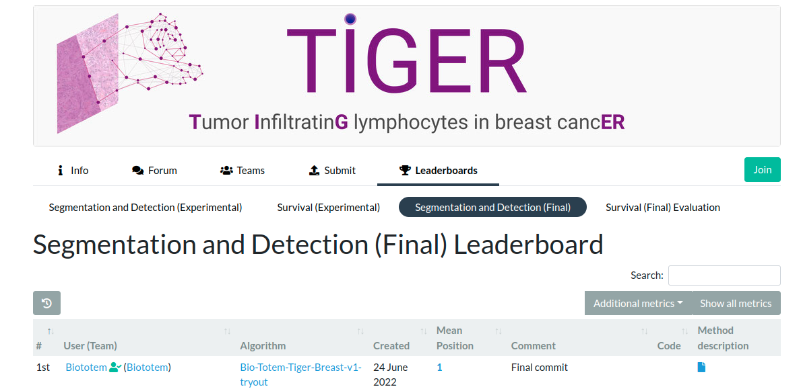

# Bio-Totem-TIGER-Algorithm-try-out

This repository provides [Bio-Totem](https://grand-challenge.org/users/Biototem/) algorithm try out scripts for [**T**umor **I**nfiltratin**G** lymphocytes in breast canc**ER**](https://tiger.grand-challenge.org/) challenge.

We got 1st at Segmentation and Detection (Final) Leaderboard:

## submit_docker_script

This subdirectory provides scripts for building TIGER challenge  algorithm-docker image base on https://tiger.grand-challenge.org/Requirements/

1. **./submit_docker_script/pkgs** is the storage of  binary package(deb format for system software installtion and whl format for python package installtion) which would be installed  in docker image by **Dockerfile**. You should download from other ways and put them to **./submit_docker_script/pkgs** 

2. **./submit_docker_script/tigeralgorithmexample** is the main process code in algorithm-docker image for prediction, based on [pathology-tiger-algorithm-example · GitHub](https://github.com/DIAGNijmegen/pathology-tiger-algorithm-example/tree/main/tigeralgorithmexample) 

3. Notice that there is no real model weight file in this repository, you can train the model you need by yourself and edit your model weight file path at **./submit_docker_script/tigeralgorithmexample/processing.py** and **./submit_docker_script/tigeralgorithmexample/nuclei_det/det_processing_loader_merge.py**

## train_script

There are two subdirectories,**./train_script/Segmentation** to segment several tissue compartments and **./train_script/Detection** to detect lymphocytes and plasma cells.

Model weights used in our submission are provided at https://drive.google.com/drive/folders/1aDyOLXyyfEW9Fz1OJCiiuLV2mG0CH0hZ?usp=sharing
